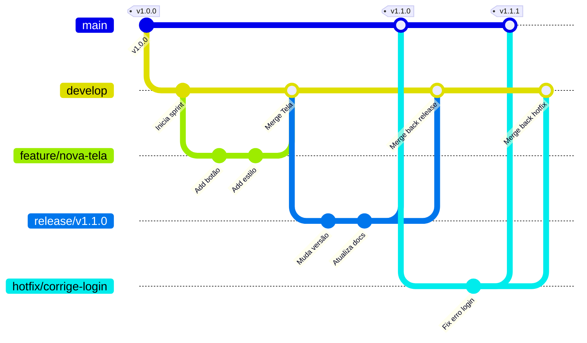

# 🌿 Gitflow: Guia Básico

O **Gitflow** é um modelo de ramificação para o Git e também uma **ferramenta de linha de comando** (`git-flow`) que automatiza todas as tarefas repetitivas de criação, tag e merge das branches desse modelo.

---

## ⚙️ Instalação e Inicialização

Se você não tem a ferramenta de linha de comando `git-flow` instalada, pode adicioná-la no seu sistema (ex: `sudo apt-get install git-flow`, `brew install git-flow`, ou habilitando pelo instalador no Windows).

Para preparar e configurar o repositório para usar a ferramenta, rode:

```bash
git flow init
```
*Dica: Você pode simplesmente apertar `Enter` em todas as opções para aceitar o padrão de nomes sugerido pela ferramenta (`main`, `develop`, `feature/`, `release/`, `hotfix/`).*

---

## 🌳 A Estrutura de Branches

- **`main`**: Código em produção (sempre reflete a última tag lançada).
- **`develop`**: Código em desenvolvimento (ambiente base de integração).
- **`feature/`**: Para desenvolver novas funcionalidades.
- **`release/`**: Para testes e polimentos finais antes de um lançamento.
- **`hotfix/`**: Para correções de emergência diretamente da produção (`main`).

---

## 🎨 Visualizando o Fluxo

Abaixo, um diagrama completo mostrando como as branches interagem no ciclo de vida de um projeto.



---

## 🚀 Como usar a ferramenta `git-flow` na prática?

O GitFlow simplifica vários comandos necessarios do git para organizar as branches.

### 1. Criando uma nova funcionalidade (Feature)
```bash
# Cria a branch 'feature/nova-tela' automaticamente a partir da develop
git flow feature start nova-tela

# ... Trabalhe no código e faça seus commits (git add / git commit) ...

# Finaliza a feature: 
# Faz merge na develop, deleta a branch local 'feature/nova-tela' e volta o checkout pra develop
git flow feature finish nova-tela
```

### 2. Lançando uma versão (Release)
Quando sua `develop` estiver pronta para uma nova versão, crie a release para homologar, testar e alterar arquivos de controle (ex: mudar versão do `package.json`).
```bash
# Cria a branch 'release/1.1.0' a partir da develop
git flow release start 1.1.0

# ... Mude a versão, faça testes, commite os ajustes finais ...

# Finaliza a release:
# Faz merge na main E na develop, cria uma Tag v1.1.0 para o git e apaga a branch 'release'
git flow release finish 1.1.0
```

### 3. Corrigindo erro crítico em produção (Hotfix)
Para casos onde não é possivel esperar pela Develop é criado o hotfix que sempre nasce direto da branch de produção (`main`).
```bash
# Cria a branch 'hotfix/corrige-login' direto a partir da main
git flow hotfix start corrige-login

# ... Resolva o bug crítico e commite ...

# Finaliza o hotfix:
# Faz merge na main E na develop, cria a Tag com a versão consertada e apaga a branch
git flow hotfix finish corrige-login
```
